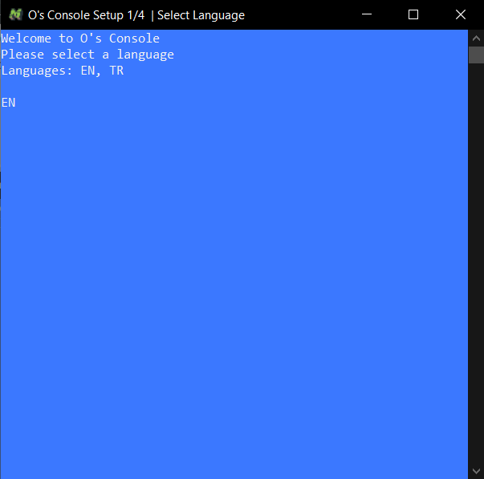
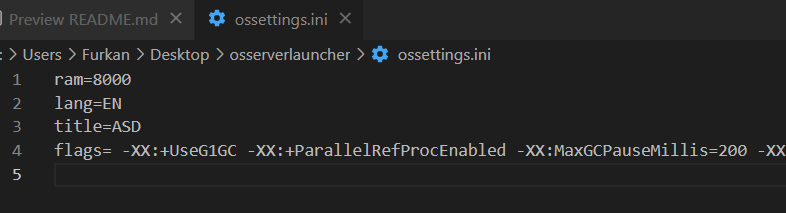

# ***Os Server Launcher***
## a command prompt launcher for Minecraft Servers focused on intelligibility and optimization




### ***Features:***
- Clean and beautiful console
- Dynamic colors depending on operations
- Easy to set RAM
- Easy to clean unneeded logs
- Option to give tags to the consoles
- Recommendations for new server owners
- Changeable start code

All settings made from console are saving to ossettings.ini
You can edit settings from there. You need to restart launcher after changing settings.

**ossettings.ini:**




### ***Features to be added:***
- Language support for English
- Multiple server jvm flag recommendations (Like ZGC and G1GC options)
- Improved and detailed recommendations
- Changeable server jar name
- More settings like setting Dnashorn deprecation warnings, setting Duser language


Current jvm flags are Aikar's flags [Click to navigate to post](https://aikar.co/2018/07/02/tuning-the-jvm-g1gc-garbage-collector-flags-for-minecraft/). His flags are very good for MC 1.8+ and Java 8+. I recommend to read all of the post even if you won't use it.

Now I started to test ZGC instead of G1GC. Here you can use my test settings (Requires Windows build 1903 or newer):
```
ram=8000
title=Test 1.17
flags= -XX:+UnlockExperimentalVMOptions -XX:+DisableExplicitGC -XX:-UseParallelGC -XX:-UseParallelGC -XX:-UseG1GC -XX:+UseZGC -Dnashorn.args=--no-deprecation-warning -Duser.language=EN
```

Check these posts if you are interested about ZGC:
* [HIGHER PERFORMANCE CRAFTING: USING JDK11+ AND ZGC](https://krusic22.com/2020/03/25/higher-performance-crafting-using-jdk11-and-zgc/)
* [Potato-Script's Linux Start Script](https://github.com/krusic22/Potato-Scripts/blob/master/Linux_StartScript.sh)

## License
[MIT](https://choosealicense.com/licenses/mit/)